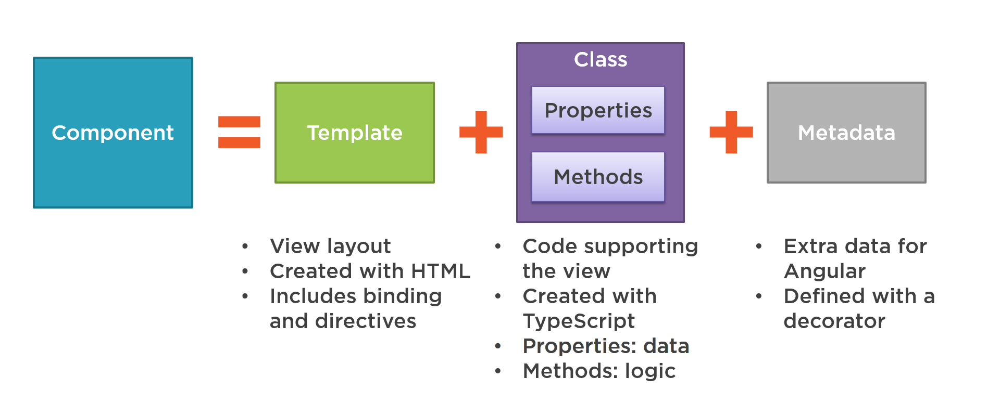
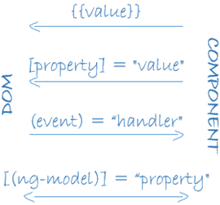

# Component

Un componente in Angular è un elemento fondamentale che definisce una porzione dell'interfaccia utente, composta da dati e elementi visivi che vengono mostrati nel DOM (vista). Esso incapsula la logica necessaria per gestire l'interazione e il comportamento dell'interfaccia.

Un componente è costituito da una classe che contiene i dati e la logica ad essi associati. Grazie ai metadati definiti dal decoratore `@Component`, il componente è composto da tre elementi principali:

- **Template (HTML)**: Definisce la struttura e la presentazione dell'interfaccia utente. È il codice HTML che viene renderizzato quando il componente viene caricato. Il template include codice HTML e può contenere direttive e binding di dati offerti da Angular, come il binding per proprietà, eventi, o classi CSS dinamiche.

- **Classe (TypeScript)**: Contiene la logica del componente. La classe è definita in TypeScript e gestisce il comportamento, i dati e le interazioni dell'interfaccia utente. Può includere proprietà, metodi e logica per gestire eventi, dati in ingresso e in uscita, e anche per effettuare chiamate API.

- **Stili (CSS/SCSS)**: Ogni componente può avere stili CSS o SCSS associati che ne determinano l'aspetto visivo. Questi stili sono applicati solo al componente specifico, grazie all'incapsulamento degli stili, evitando conflitti con altri componenti dell'applicazione.

<figure markdown>
  { width="550" : .center}
  <figcaption>Figura 3: Schema Component</figcaption>
</figure>

Vediamo un esempio di semplice component:
!!! example
    ```ts
    import { Component } from '@angular/core';

    @Component({
      selector: 'app-hello-world',  
      templateUrl: './hello-world.component.html',
      styleUrls: ['./hello-world.component.css']
    })
    export class HelloWorldComponent {

      public message: string;

      constructor(){
        this.message = 'Ciao mondo! Benvenuto su Angular!';
      }
      
    }

    ```

Grazie al decoratore `@Component` possiamo definire il component con i seguenti metadati:

- **selector**: definisce il nome del tag HTML personalizzato che Angular usa per individuare dove istanziare e rendere visibile il componente. Ad esempio, se il template contiene `<app-hello-world></app-hello-world>`, Angular rileva il tag e monta un'istanza di `HelloWorldComponent` in quella posizione.

- **templateUrl**: indica il percorso relativo al file HTML che definisce la vista del componente. In alternativa, è possibile specificare il template direttamente nel codice tramite la proprietà template.

- **styleUrls**: specifica uno o più percorsi ai file CSS (o SCSS) che contengono gli stili applicati solo al componente. Gli stili definiti in questi file si applicano in modo isolato al componente, grazie all'incapsulamento dello stile che Angular applica di default (ViewEncapsulation).

!!!Info
    In Angular, **ViewEncapsulation** controlla come gli stili CSS definiti in un componente vengono applicati:
      - Solo al componente stesso (incapsulamento).
      - Oppure si propagano anche agli altri elementi HTML (come avviene normalmente nel browser).

    L'obiettivo principale è isolare gli stili di un componente, evitando che "inquinino" altri componenti o che vengano sovrascritti da stili esterni.

    Angular fornisce tre modalità principali:

    | Tipo                  | Descrizione                                                                 | Effetto pratico                                                        |
    |-----------------------|-----------------------------------------------------------------------------|------------------------------------------------------------------------|
    | **Emulated** (predefinito) | Simula l'incapsulamento degli stili. Angular aggiunge attributi HTML personalizzati ai selettori CSS per limitare l'ambito. | Gli stili sono applicati solo al componente e ai suoi figli.           |
    | **None**               | Nessun incapsulamento: gli stili sono globali.                             | Gli stili si propagano ovunque nell'applicazione.                      |
    | **ShadowDom**          | Usa direttamente il vero Shadow DOM del browser (se disponibile).           | Gli stili sono naturalmente isolati grazie al browser.                 |


    Il ViewEncapsulation puo essere configurato nella proprieta encapsulation di `@Component`:

    ```ts
      import { Component, ViewEncapsulation } from '@angular/core';

      @Component({
        selector: 'app-example',
        templateUrl: './example.component.html',
        styleUrls: ['./example.component.css'],
        encapsulation: ViewEncapsulation.Emulated // (default)
      })
      export class ExampleComponent { }

    ```


Non è stato riportato nell'esempio del component `HelloWorldComponent`, esiste anche la proprieta `providers `che permette di dichiarare i servizi di cui il componente ha bisogno. Angular crea un'istanza locale di quel servizio solo per quel componente e per i suoi figli.
Questo meccanismo è alla base del sistema di Dependency Injection di Angular. Approfondiremo l'argomento nel capitolo dedicato ai servizi.

!!!Note
    In Angular esiste la convenzione di dare come nome della classe del componente usando il PascalCase: I nomi delle classi devono iniziare con una lettera maiuscola e ogni nuova parola deve iniziare con una maiuscola.

    Esempio: `HelloWorldComponent`

    per coerenza il nome della classe deve riflettere il nome del file in  kebab-case: I selettori devono essere in minuscolo e separati da trattini.
    
    File: `hello-word.component.ts`

    Analogamente anche il selettore deve essere in kebab-case aggiungendo un prefisso.

    `selector: 'app-hello-world'`,

    solitamente si utilizza il prefisso app- ma a seconda delle norme interne dell'azienda puo essere stabilito un altro dipo di prefisso.

## Templates e views

In Angular, le viste non sono necessariamente costituite da un singolo componente con il suo template, ma è altamente consigliato adottare una struttura gerarchica di componenti, che possono formare l'intera vista o semplicemente un singolo widget. Questa gerarchia permette di gestire in modo efficiente la visibilità e la modifica di sezioni o pagine dell'interfaccia utente, trattandole come un'unica entità coesa.

<figure markdown>
  { width="300" : .center}
  <figcaption>Figura 4: Schema gerarchia di components</figcaption>
</figure>

Come si può osservare nell'immagine precedente, il template radice è costituito da un insieme di componenti figli, che a loro volta possono includere altre viste, dando così origine a una gerarchia di componenti.

!!!note
    Una gerarchia di viste può comprendere componenti appartenenti allo stesso NgModule, ma anche componenti definiti in NgModule differenti. 

## Sintassi Template
Un template è simile a un normale HTML, ma include anche la sintassi specifica di Angular, che modifica l'HTML in base alla logica dell'applicazione e allo stato dei dati del DOM. Nel template puoi utilizzare il data binding per sincronizzare i dati dell'applicazione con quelli del DOM, le pipe per trasformare i dati prima che vengano visualizzati, e le directive per applicare la logica dell'applicazione a ciò che viene mostrato.

Vediamo un esempio di template: 

!!! example
    ```html
      <!-- hero-list.component.html -->
      <div class="hero-list">
        <h2>Lista degli Eroi</h2>
        
        <!-- Interpolazione (data binding) -->
        <p>Benvenuto, {{ user.name }}!</p>
        
        <!-- Data binding per l'attributo -->
        

        <!-- Diretiva condizionale -->
        <div *ngIf="heroSelected">
          <p>L'eroe è selezionato!</p>
        </div>
        
        <ul>
          <!-- Event binding -->
          <li *ngFor="let hero of heroes" (click)="selectHero(hero)">{{ hero.name }}</li>
        </ul>

        <!-- ngSwitch per visualizzare informazioni in base all'eroe selezionato -->
        <div [ngSwitch]="heroSelected.name">
          <div *ngSwitchCase="'Iron Man'">
            <h3>Iron Man</h3>
            <p>Iron Man è un genio miliardario, playboy e filantropo che combatte per la giustizia!</p>
          </div>
          <div *ngSwitchCase="'Spider-Man'">
            <h3>Spider-Man</h3>
            <p>Spider-Man è un giovane eroe che utilizza i suoi poteri per proteggere New York!</p>
          </div>
          <div *ngSwitchDefault>
            <h3>Eroe Non Selezionato</h3>
            <p>Seleziona un eroe dalla lista per visualizzare ulteriori dettagli!</p>
          </div>
        </div>

        <!-- Componente Figlio con Two-Way Data Binding -->
        <app-hero-detail [hero]="heroSelected" (heroSelected)="onHeroSelectedDetails($event)"></app-hero-detail>
      </div>

    ```
Nelle seguenti sezioni verrano illustarte tutti i nuovi costrutti di Angular.

### Direttive Build-In

In Angular, esistono delle direttive built-in, ossia direttive predefinite fornite direttamente dal framework, che permettono di controllare il comportamento, l'aspetto o la struttura del DOM in modo dinamico. Sono strumenti molto potenti perché consentono di modificare la pagina HTML in base allo stato dell'applicazione senza dover manipolare direttamente il DOM con JavaScript.

Possiamo dividere le direttive built-in in due grandi categorie: 
- direttive strutturali:
  - *ngIf
  - *ngSwitch
  - *ngFor
- direttive di attributo:
 - ngClass
 - ngStyle

#### *ngIf

La direttiva `*ngIf` è una direttiva strutturale built-in fornita da Angular. Permette di aggiungere o rimuovere dinamicamente un elemento dal DOM (Document Object Model) in base a una condizione booleana. Quando la condizione associata a `*ngIf` è vera, l'elemento (o il blocco di contenuto) viene aggiunto al DOM. Al contrario, se la condizione è falsa, l'elemento viene completamente rimosso dal DOM.

Quando un elemento viene rimosso tramite `*ngIf`, non viene semplicemente nascosto, ma viene effettivamente eliminato dal DOM. Di conseguenza, ogni volta che la condizione cambia e l'elemento viene reinserito, viene creato nuovamente, perdendo qualsiasi stato precedente.

!!! example
    ```html
    <div *ngIf="heroSelected">
      <p>L'eroe è selezionato!</p>
    </div>
    ```
#### ngSwitch

La direttiva `ngSwitch` è una direttiva strutturale di Angular che permette di gestire la visualizzazione condizionale di blocchi di codice all'interno di un template. Si utilizza per implementare un comportamento simile a un'istruzione switch-case in altri linguaggi di programmazione, dove diverse condizioni vengono verificate e il blocco di codice associato al caso corrispondente viene eseguito.

!!! example
    ```html
    <div [ngSwitch]="heroSelected.name">
      <div *ngSwitchCase="'Iron Man'">
        <h3>Iron Man</h3>
        <p>Iron Man è un genio miliardario, playboy e filantropo che combatte per la giustizia!</p>
      </div>
      <div *ngSwitchCase="'Spider-Man'">
        <h3>Spider-Man</h3>
        <p>Spider-Man è un giovane eroe che utilizza i suoi poteri per proteggere New York!</p>
      </div>
      <div *ngSwitchDefault>
        <h3>Eroe Non Selezionato</h3>
        <p>Seleziona un eroe dalla lista per visualizzare ulteriori dettagli!</p>
      </div>
    </div>
    ```
In questo esempio:

- `ngSwitch` è la direttiva che viene applicata all'elemento contenitore e associa un'espressione da valutare.
- `ngSwitchCase` viene applicato agli elementi figlio del contenitore e rappresenta un singolo caso da confrontare con il valore dell'espressione.

#### *ngFor

La direttiva `*ngFor` è una direttiva strutturale di Angular che permette di iterare su una collezione di dati, come un array o una lista, e generare dinamicamente un elemento del DOM per ogni elemento della collezione.

!!! example
    ```html
    <ul>
      <li *ngFor="let hero of heroes">{{ hero.name }}</li>
    </ul>
    ```
In questo esempio:

- `let hero` è la variabile che rappresenta ciascun elemento dell'array durante l'iterazione.
- `heroes` è la collezione di dati che si desidera iterare.

In Angular, puoi utilizzare l'attributo index all'interno della direttiva `*ngFor` per ottenere l'indice dell'elemento corrente nell'iterazione. L'indice è numerato a partire da 0 per il primo elemento.

!!! example
    ```html
    <div *ngFor="let hero of heroes; let i = index">
      <p>{{ i }}: {{ item }}</p>
    </div>
    ```
In questo esempio:

- `let i = index` definisce una variabile i che rappresenta l'indice dell'elemento corrente.
- `{{ i }}` stampa l'indice dell'elemento nell'array, tramite interpolazione (lo vedremmo nella sezione successiva dedicata al data binding).


!!!tip
    La direttiva `trackBy` in Angular è una funzionalità avanzata che viene utilizzata insieme a `*ngFor` per migliorare le prestazioni quando si lavora con liste dinamiche. `trackBy` permette ad Angular di identificare univocamente gli elementi all'interno di una lista, in modo che l'engine di rendering possa determinare con maggiore precisione quali elementi sono cambiati, aggiunti o rimossi, evitando di rifare il rendering dell'intera lista ogni volta che cambia uno degli elementi, ma solo degli elementi che sono cambiati.

    Sintassi:

    ```html
    <li *ngFor="let hero of heroes; trackBy: trackByHeroId">
      {{ item.name }}
    </li>
    ```
    `trackBy: trackByHeroId` specifica una funzione personalizzata che Angular utilizza per identificare in modo univoco ogni elemento nella lista. Questa funzione deve restituire un valore univoco per ogni elemento.

    ```ts
    trackByHeroId(index: number, hero: Hero): number {
        return hero.id;
    }
    ```

    `trackByHeroId` è una funzione che restituisce `hero.id`, un valore univoco per ogni eroe. Questo permette ad Angular di tracciare ogni elemento della lista in modo efficiente.

#### ngClass

`ngClass` permette di aggiungere, rimuovere o cambiare classi CSS su un elemento HTML in modo dinamico.
È molto utile quando vogliamo applicare stili diversi in base a condizioni specifiche senza dover scrivere logica complicata nel template.

!!! example
    ```html
    <div [ngClass]="{'active': isActive, 'disabled': !isActive}">
      Pulsante
    </div>
    ```

Se `isActive` è true, il div riceverà la classe active; altrimenti riceverà la classe disabled.
ngClass può accettare anche array di classi o semplici stringhe di classi separate da spazi.

#### ngStyle

`ngStyle` permette di applicare stili CSS direttamente sull’elemento HTML in maniera dinamica, senza dover passare attraverso le classi.

!!! example
    ```html
    <div [ngStyle]="{'color': isActive ? 'green' : 'red', 'font-size': '20px'}">
      Testo dinamico
    </div>
    ```

Il colore del testo sarà verde se `isActive` è true, oppure rosso se `isActive` è false, e avrà sempre una dimensione del font di 20px.

### Data Binding

Il data binding è il meccanismo che collega i dati del componente alla vista (template HTML) e viceversa.
Oltre a gestire l'interazione tra logica e interfaccia, il data binding consente anche il passaggio di dati tra componenti lungo la loro gerarchia, facilitando così la comunicazione tra componenti padre e figlio.

Grazie al data binding, è possibile aggiornare dinamicamente la visualizzazione dei dati nella pagina e gestire in modo reattivo gli eventi dell'utente, come click, input o cambiamenti di stato.

Angular offre quattro principali modalità di data binding:

| Tipo              | Descrizione                                                         | Sintassi                     |
|-------------------|---------------------------------------------------------------------|-------------------------------|
| **Interpolazione**    | Collega dati dal componente alla vista, per visualizzare valori.    | `{{ proprietà }}`             |
| **Property Binding**  | Collega dati dal componente ad attributi/proprietà HTML.            | `[attributo]="proprietà"`     |
| **Event Binding**    | Collega eventi della vista al metodo del componente.                | `(evento)="metodo()"`         |
| **Two-way Binding**   | Sincronizza dati in entrambe le direzioni tra componente e vista.   | `[(ngModel)]="proprietà"`     |

<figure markdown>
  { width="200" : .center}
  <figcaption>Figura 5: Schema tipologie di data binding</figcaption>
</figure>

#### Interpolazione ({{ }})

Permette di inserire valori direttamente nell'HTML 

!!! example

    ```ts
    export interface Hero {
      name: string;
      surname: string;
      isSelected: boolean;
      imageUrl: string;
      creationDate: string;
    }

    ...

    export class HelloWorldComponent {

      public user: Hero;

      constructor(){
        this.user = {name: Mario,
          surname: Rossi,
          imageUrl:'./assets/logo.png',
        };
      }
      
    }
    ```

Nel template: 

!!! example
    ```html
    <p>Benvenuto, {{ user.name }}!</p>
    ```
Nell'esempio grazie alla interpolazione è possibile visualizzare valori salvati in una variabile o in un campo di oggetto all'interno dell'HTML.

#### Property Binding ([ ])

Collega una proprietà del componente a una proprietà HTML o di un componente figlio.

Riprendendo il ts precedente: 

!!! example
    ```html
    
    ```

#### Event Binding (( ))

Permette di rispondere agli eventi dell'utente, come click, input, submit, ecc.

!!! example
    ```html
    <li *ngFor="let hero of heroes" (click)="selectHero(hero)">{{ hero.name }}</li>
    ```

Nel componente:

!!! example
    ```ts
    public selectHero(hero: Hero):void{
      this.selectedHero = hero;
    }
    ```

Quando l'utente clicca il pulsante, verrà eseguito il `selectHero` passando l'elemento cliccato.


#### Two-way Binding ([( )])

Combina property binding ed event binding: sincronizza il valore sia dal componente alla vista, sia dalla vista al componente.

!!! example

    ```html
    <input [(ngModel)]="hero.nome">
    <p>Hai scritto: {{ hero.nome }}</p>
    ```
Grazie alla direttiva `ngModel` un valore di proprietà dati scorre nella casella di input dal componente come con l’associazione di proprietà. Le modifiche dell’utente tornano anche al componente, reimpostando la proprietà sul valore più recente, come con l’associazione di eventi.

Inoltre grazie al Two-way Binding è pssibile la comunicazione tra componenti padre e figlio.

Nel template padre:

!!! example
    ```html
    <app-hero-detail [hero]="hero" (heroSelected)="onHeroSelectedDetails($event)"></app-hero-detail>
    ```

Nel component figlio:

!!! example
    ```ts
    ...
    export class HeroDetailComponent {
      @Input() hero: Hero = '';
      @Output() heroSelected: EventEmitter<string> = new EventEmitter<string>();

      onDetails(details: string) {
        this.heroSelected.emit(details);
      }
    }
    ```

Tramite la sintassi `[hero]="hero"`, il padre passa al figlio un oggetto Hero, sfruttando il meccanismo del property binding di Angular. Il valore assegnato all'input del figlio (`@Input() hero`) viene quindi popolato direttamente con l'oggetto fornito dal padre.

Allo stesso tempo, il padre si mette in ascolto dell'evento personalizzato (`heroSelected`). Questo evento viene definito nel figlio usando `@Output()` e un `EventEmitter<string>`, che consente al figlio di notificare al padre un'azione o un cambiamento. Quando il figlio esegue il metodo `onDetails(details: string)`, chiama `this.heroSelected.emit(details)`, emettendo così l'evento verso il padre. Il padre intercetta l'evento attraverso la sintassi `(heroSelected)="onHeroSelected($event)"`, richiamando il proprio metodo onHeroSelected e passando come parametro il valore emesso dal figlio.

Ciò che viene emesso dal component figlio è ricavabile dal padre attraverso la variabile `$event`.

## Ciclo di vita di un componente (Lifecycle)

Gli Angular Lifecycle Hooks (metodi del ciclo di vita) permettono di eseguire codice in momenti specifici della vita di un componente o di una direttiva. Ogni hook corrisponde a una fase precisa: dall'inizializzazione alla distruzione. 

| Hook                   | Descrizione |
|-------------------------|-------------|
| `ngOnChanges()`          | Viene eseguito ogni volta che cambia il valore di una proprietà di input. Si attiva prima dell'inizializzazione del componente e ogni volta che uno degli input viene modificato. |
| `ngOnInit()`             | Rappresenta la fase di inizializzazione del componente. Viene eseguito una sola volta dopo il primo `ngOnChanges()`. |
| `ngDoCheck()`            | Metodo richiamato durante il controllo interno di Angular per intercettare modifiche ai dati o allo stato dei componenti. Segue ogni esecuzione di `ngOnChanges()` e `ngOnInit()`. |
| `ngAfterContentInit()`   | Eseguito dopo che Angular ha proiettato il contenuto nel componente. Viene chiamato una sola volta, immediatamente dopo il primo `ngDoCheck()`. |
| `ngAfterContentChecked()`| Richiamato dopo ogni verifica del contenuto proiettato. Si attiva dopo `ngAfterContentInit()` e successivamente a ogni `ngDoCheck()`. |
| `ngAfterViewInit()`      | Indica che la vista e i componenti figli sono stati inizializzati. È eseguito una sola volta dopo `ngAfterContentChecked()`. |
| `ngAfterViewChecked()`   | Si verifica dopo ogni verifica della vista del componente. Chiamato dopo `ngAfterViewInit()` e successivamente a ogni `ngAfterContentChecked()`. |
| `ngOnDestroy()`          | Ultima fase del ciclo di vita: chiamato immediatamente prima che Angular distrugga il componente. Serve per liberare risorse, annullare sottoscrizioni e rimuovere event handler per evitare memory leaks. |

## ng-template

`ng-template` è un contenitore invisibile per contenuto che Angular non renderizza immediatamente nel DOM. Il contenuto all'interno di un ng-template viene creato e inserito solo quando serve, ad esempio in base a condizioni o strutture dinamiche 

!!! example
    ```html
    <div *ngIf="customerData; else loading">

    <ng-template #loading>
      <p>Caricamento in corso...</p>
    </ng-template>
    ```

Il paragrafo sarà creato solo se customerData è false, senza aggiungere elementi extra nel DOM. Viene creato un riferimento nel `ng-template`(`#loading`) per indicare a che condizione deve riferirsi.

## ng-content

`ng-content` è usato per realizzare il content projection, ovvero per permettere di inserire contenuto dinamico dentro un componente da parte del suo genitore.
Il componente definisce un punto (`<ng-content>`) in cui chi lo usa può "iniettare" del contenuto HTML.

Grazie a `ng-content` possiamo rendere i componenti riutilizzabili e flessibili, lasciando scegliere all'esterno cosa mostrare dentro.

Esempio:

Nel componente figlio app-card:

!!! example
    ```html
    <div class="card">
      <ng-content></ng-content>
    </div>

    ```

Nel componente padre:

!!! example
    ```html
    <app-card>
      <p>Questo paragrafo sarà proiettato dentro la card!</p>
    </app-card>

    ```

Il tag `<p>` viene automaticamente inserito dove si trova `<ng-content>` nel figlio.

## ng-container

`ng-container` è un contenitore logico che permette di raggruppare più elementi senza creare nuovi nodi nel DOM.
Serve soprattutto quando vogliamo applicare direttive strutturali come `*ngIf`, `*ngFor`, `ngSwitch` su più elementi contemporaneamente, senza introdurre tag superflui come `<div>`.

`ng-container` non si vede nel DOM: il browser non renderizza nulla per esso.

!!! example
    ```html
    <ng-container *ngIf="isLoggedIn">
      <p>Benvenuto!</p>
      <button>Logout</button>
    </ng-container>
    ```

Il paragrafo e il bottone saranno creati solo se `isLoggedIn` è vero, senza aggiungere elementi extra nel DOM.