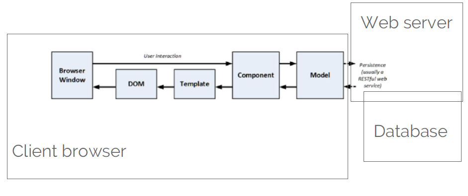

# Angular

Angular è un framework Front-End per lo sviluppo di Single Page Application (SPA), creato e mantenuto da Google. Nato come evoluzione di AngularJS, Angular è progettato per facilitare la creazione di applicazioni moderne, scalabili e manutenibili.
Grazie a una struttura basata su componenti, una potente gestione delle dipendenze e strumenti integrati per il routing, il form handling e la comunicazione con API, Angular permette agli sviluppatori di costruire interfacce utente dinamiche e performanti.

Angular si ispira al pattern architetturale MVC (Model-View-Controller), riorganizzandolo in una forma più moderna e component-based. In Angular, la View è rappresentata dal template HTML, il Model è costituito dai dati e dagli oggetti gestiti dai componenti e dai servizi, mentre la Controller logic è incorporata direttamente nei componenti attraverso il codice TypeScript. Questa struttura favorisce una netta separazione delle responsabilità e rende il flusso dei dati chiaro e controllato.

Ogni componente Angular è associato a un file HTML, che definisce la struttura visiva (il template) dell'interfaccia, e a file CSS o SCSS, che gestiscono gli stili e l'aspetto grafico. Questa separazione chiara tra logica, struttura e presentazione aiuta a mantenere il codice organizzato e facilmente manutenibile.

Per la logica di business viene utilizzato TypeScript, un superset di JavaScript che introduce la tipizzazione statica, il supporto a classi e interfacce, e avanzate funzionalità di tooling. L’utilizzo di TypeScript migliora la qualità del codice, facilita la manutenzione e consente di sfruttare strumenti di sviluppo più potenti.

!!! note 

    In questo documento verranno trattate le versioni 7 e 12 di Angular, in quanto compatibili con il framework utilizzato dal cliente XDCE.

!!! info
    [Documentazione Angular 7](https://v7.angular.io/docs) 
    [Documentazione Angular 12](https://v12.angular.io/docs)
    

## Angular MVC

Il Model-View-Controller (MVC) è un design pattern tipicamente utilizzato per lo sviluppo di web applications perché permette la “separation of concerns” in cui il data model viene separato dalla business e presentation logic.

Nel seguente schema viene riportato come MVC è stato riorganizzato in una forma component-based.

<figure markdown>
  { width="550" : .center}
  <figcaption>Figura 1: Schema MVC in chiave Angular</figcaption>
</figure>

All'interno del cliente troviamo gli elementi: Model, Component, Template, DOM e Browser Window.

Il Model è il livello che sa cosa rappresentano i dati e come gestirli, ma non si occupa di come vengono mostrati o come vengono interagiti dall'utente. Perciò, risiedono i dati dell'applicazione e i servizi che offrono la logica per recuperare e manipolare i dati oltre a fornire chiamate HTTP a API. Inoltre, possono risiedere enum o interfacce che rappresentano la struttura dei dati.

!!! note
    Non deve esporre i dettagli su come i dati sono ottenuti o gestiti (il web service non deve essere esposto al controller e alle view). 
    Non deve contenere la logica che trasforma i dati rispetto alle interazioni con l’utente (compito del controller). 
    Non deve contenere la logica di visualizzazione dei dati (compito della view).

Il Component svolge il ruolo del Controller tradizionale dell'MVC. Ha il compito di gestire la logica dell’interfaccia utente: riceve input dall'utente, reagisce agli eventi (click, input, ecc.), e aggiorna i dati del Model o della View. Percio, il component si occupa di interagire con il Model per fornire dati e comportamenti al template HTML

Il Component in Angular è composto da:

- un file TypeScript (.ts) che contiene la classe con proprietà e metodi → (Controller);
- un file HTML (.html) che definisce la struttura visiva → (View);
- uno o più file CSS/SCSS (.css o .scss) per gli stili → (Styling).

!!! note
    Non deve gestire la visualizzazione dei dati (non deve modificare il DOM). 
    Non deve gestire la logica di persistenza dei dati (Compito del modello attraverso il web service).

Il Template è la parte dell'applicazione che definisce come i dati vengono presentati all'utente. Contiene la logica di markup necessaria a presentare i dati all’utente.

Il template è normalmente scritto in HTML, ma arricchito con funzionalità aggiuntive fornite da Angular, come:
- Data binding (legare i dati del componente al template)
- Strutture di controllo (es. *ngIf, *ngFor)
- Event binding (es. (click), (input))
- Pipe per la formattazione dei dati

Queste funzionalità verrano illustarte nei prossimi capitoli.

!!! note
    Non deve contenere alcuna logica di modifica, creazione e gestione dei dati.  
    Non deve contenere la logica dell’applicazione.

## Decoratori

Angular sfrutta i decoratori introdotti da TypeScript per "annotare" classi, metodi o proprietà, arricchendoli di metadati e abilitando funzionalità avanzate a runtime.

Un esempio tipico è il decoratore @Component(), che viene applicato a una classe per indicare che rappresenta un componente Angular. Il decoratore fornisce ad Angular tutte le informazioni necessarie, come il selettore, il template e i file di stile associati.

I decoratori possono essere configurati tramite parametri passati al momento della dichiarazione, consentendo una gestione dinamica e personalizzata del comportamento dell'applicazione.

| Decorator | Descrizione |
|:-------------- |:-------------- |
| @NgModule | Definisce un modulo che contiene componenti, direttive, pipe e providers. |
| @Component | Dichiara che una classe è un componente e ne fornisce i meta-dati. |
| @Injectable | Dichiara che una classe ha dipendenze che devono essere iniettate nel costruttore quando il Dependency Injector crea l’istanza della classe. |
| @Directive | Dichiara che una classe è una direttiva e ne fornisce i metadati. |
| @Pipe | Dichiara che una classe è una pipe e ne fornisce i metadati. |
| @Input | Dichiara una proprietà di input che si può aggiornare con un property binding. |
| @Output | Dichiara una proprietà di output che emette eventi a cui ci si può sottoscrivere con un event binding. |
| @HostBinding | Effettua il binding di una proprietà dell’elemento host ad un proprietà o direttiva del componente. |
| @HostListener | Sottoscrizione ad un evento dell’elemento host tramite una direttiva o metodo del componente, eventualmente passando un parametro. |
| @ContentChild | Esegue una query di selezione dei componenti figli, effettuando il binding del primo risultato ottenuto con una proprietà della classe. Si riferisce ai componenti che sono figli del componente corrente nel DOM in cui esso è utilizzato. |
| @ContentChildren | Esegue una query di selezione dei componenti figli, effettuando il binding dei risultati ottenuti con una proprietà della classe. Si riferisce ai componenti che sono figli del componente corrente nel DOM in cui esso è utilizzato. |
| @ViewChild | Esegue una query di selezione dei componenti figli, effettuando il binding del primo risultato ottenuto con una proprietà della classe. Si riferisce ai componenti che sono inseriti nel DOM del template collegato al componente. |
| @ViewChildren | Esegue una query di selezione dei componenti figli, effettuando il binding dei risultati ottenuti con una proprietà della classe. Si riferisce ai componenti che sono inseriti nel DOM del template collegato al componente. |
