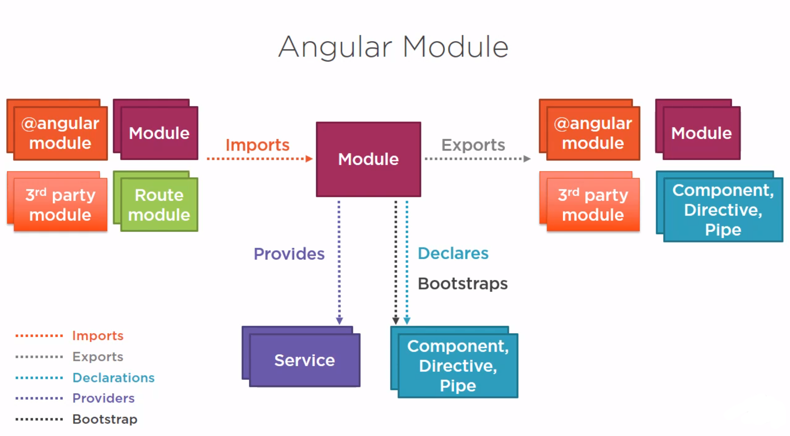

# NgModule

Le applicazioni Angular sono composte da blocchi chiamati moduli o NgModules.
Un modulo in Angular è una raccolta logica di componenti, direttive, pipe e servizi, raggruppati nello stesso contesto di compilazione.
Un NgModule può inoltre importare funzionalità da altri moduli ed esportare le proprie, rendendole disponibili ad altre parti dell'applicazione. Ne conseguono i vantaggi di una chiara organizzazione dell'applicazione e dalla posibilità di riuso del codice.

!!!note 
    Le principali librerie integrate di Angular sono organizzate in NgModules, ad esempio: 
    - `HttpClientModule` da `@angular/common/http` 
    - `FormsModule` da `@angular/forms`

## Struttura

Ogni applicazione Angular ha almeno un modulo principale, detto root module, che per convenzione viene chiamato AppModule.
Il root module definisce come effettuare il bootstrapping dell’applicazione, ovvero quali componenti "root" inserire inizialmente nella pagina.

<figure markdown>
  { width="400" : .center}
  <figcaption>Figura 2: Schema Angular Module</figcaption>
</figure>


Un modulo Angular viene definito tramite una classe decorata con il decorator `@NgModule`. Questo decorator riceve come parametro un oggetto che descrive i metadati del modulo:

- `declarations`: i componenti, i servizi, le direttive e le pipe dichiarate all'interno del modulo;

- `exports`: componenti, direttive o pipe che il modulo rende disponibili ad altri moduli;

- `imports`: gli altri moduli i cui componenti o servizi sono necessari a questo modulo;

- `providers`: i servizi disponibili tramite dependency injection all'interno dell'applicazione.

- `bootstrap`: usato solo nel root module, specifica il componente principale che Angular deve creare e inserire nel DOM quando viene avviata l'applicazione.


!!!note
    Affinché il browser possa accedere al codice contenuto nei moduli importati, è necessario specificare dove si trovano questi moduli. A questo scopo si utilizzano i moduli TypeScript, che descrivono l'associazione tra gli oggetti esportati e i file nei quali il codice è stato definito. <br>
    Per esempio:
    ```ts
    import { CommonModule } from '@angular/common';
    ```

!!! example
    ```ts
    import { NgModule } from '@angular/core';
    import { CommonModule } from '@angular/common';
    import { AppComponent } from './app.component';
    import { LoggerService } from './logger.service';

    @NgModule({
      declarations: [
        AppComponent
      ],
      imports: [
        CommonModule
      ],
      providers: [
        LoggerService 
      ],
      exports: [
        AppComponent
      ]
    })
    export class AppModule { } //Angular module

    ```


## forRoot( )

Il metodo `forRoot()` permette di dichiarare che un modulo fornisce dei servizi tramite il campo providers, i quali devono essere registrati una sola volta all'interno del modulo principale dell'applicazione.
È utile utilizzare `forRoot()` quando si desidera che un servizio di un modulo sia gestito come singleton, ovvero che esista un'unica istanza condivisa in tutta l'applicazione.

Il `forRoot()` è un metodo statico che accetta una configurazione opzionale e restituisce un oggetto di tipo `ModuleWithProviders<T>` che include un array di provider.
Tutti i provider registrati attraverso `forRoot()` vengono caricati in modo eager, cioè immediatamente all'avvio dell'applicazione.

Esempio:

Supponiamo di avere un `CustomMenuModule` che fornisce un servizio `MenuService`.

!!! example
    ```ts
    //custom-menu.module.ts
    @NgModule({
      declarations: [MenuComponent],
      exports: [MenuComponent]
    })
    export class CustomMenuModule {
      static forRoot(config: MenuConfig): ModuleWithProviders<CustomMenuModule> {
        return {
          ngModule: CustomMenuModule,
          providers: [
            { provide: MenuConfig, useValue: config },
            MenuService
          ]
        };
      }
    }
    ```

Il `forRoot()` ritorna l'oggetto `ModuleWithProviders`, che restituisce un modulo insieme a suoi provider, in questo caso `MenuService` e la sua configurazione. Se non viene ritornato un oggetto `ModuleWithProviders`, Angular non sa che insieme al modulo che provider registrare.

Quindi in providers registriamo `MenuService` una sola volta.

Nel `AppModule` importiamo `CustomMenuModule` indicando una configurazione al menù

!!! example
    ```ts
    //app.module.ts
    imports: [
      CustomMenuModule.forRoot({ theme: 'dark' })
    ]
    ```
## forChild( )

Il metodo `forChild()` permette di importare un modulo senza reimpostare anche i provider definiti in `forRoot()`. Permette quindi di utilizzare solo i componenti di un modulo in altre parti dell'applicazione senza duplicare/ridefinire i servizi.

!!!note
    il metodo statico `forChild()` non accetta configurazioni e non registra nuovi provider. Serve solo per importare componenti, direttive, e pipe.

Esempio:

Se vogliamo aggiungere il `forChild()` nel `customerMenu`.

!!! example
    ```ts
    //custom-menu.module.ts
    static forChild(): ModuleWithProviders<CustomMenuModule> {
      return {
        ngModule: CustomMenuModule,
        providers: [] // Nessun provider
      };
    }
    ```


Dove lo importiamo usiamo il `forChild()`.

!!! example
    ```ts
    //app.module.ts
    imports: [
      CustomMenuModule.forChild()
    ]
    ```

Il `forChild()` risulta utile per due motivi principali:

- Definire le rotte nei moduli secondari:
    Per esempio, si immagini di avere un'applicazione di e-commerce. Nel modulo principale si stabiliscono le rotte principali una sola volta tramite `forRoot()`, come la Home, la pagina dei Prodotti, il Carrello, ecc.. . Nei moduli secondari, invece, si usano le rotte tramite forChild per aggiungere rotte specifiche relative solo a quel modulo. Ad esempio, nel modulo che gestisce i prodotti, si potrebbero definire rotte come il dettaglio del prodotto o la pagina per la modifica di un prodotto.

- Abilitare il Lazy Loading:
    `forChild()` è anche essenziale per implementare il lazy loading, una tecnica che consente di caricare i moduli solo quando sono effettivamente necessari. Questo permette di ottimizzare le prestazioni dell'applicazione, caricando solo il codice relativo alle funzionalità richieste dall'utente, riducendo così il tempo di caricamento iniziale.


!!!info
    | Metodo     | Dove si usa                           | Cosa fa                                              |
    |------------|---------------------------------------|------------------------------------------------------|
    | `forRoot()` | Nel `AppModule` (root module)         | Registra servizi/providers (singleton)               |
    | `forChild()` | Nei feature module o lazy module     | Usa solo componenti/direttive/pipe, senza duplicare servizi |


