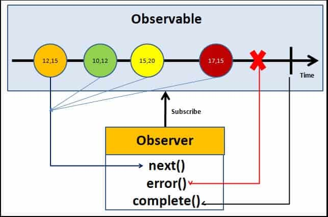

# Observables

Un Observable è un oggetto che rappresenta un flusso di dati nel tempo, utile per gestire eventi asincroni. Si basa sul pattern **Observer** e viene utilizzato per scambiare messaggi tra due entità: il **publisher** (emettitore) e il **subscriber** (consumatore). In Angular, tutto questo è implementato tramite la libreria RxJS.
Gli Observable sono fondamentali per la gestione reattiva e asincrona dei dati, come richieste HTTP, eventi dell’utente o dati che cambiano dinamicamente nel tempo.
Un Observable definisce una funzione che emette valori a uno o più observer. Tuttavia, questa funzione non viene eseguita finché un subscriber non si iscrive utilizzando il metodo `subscribe()`.

Una volta iscritta, l'entità riceve notifiche tramite tre metodi principali:

- `next(value)`: emette un nuovo valore al subscriber;
- `error(err)`: segnala un errore e termina il flusso (nessun altro valore verrà emesso dopo);
- `complete()`: indica che il flusso di dati è terminato con successo.
Questi tre metodi fungono da handler degli eventi ricevuti.

La ricezione dei dati continua fino a che:

- l’Observable completa (ovvero ha finito di emettere valori e notifica ai subscriber la fine del flusso),
- si verifica un errore,
- oppure il subscriber si disiscrive manualmente tramite `unsubscribe()`.

<figure markdown>
  { width="400" : .center}
  <figcaption>Figura 7: Schema Observable</figcaption>
</figure>

!!! example
    ```ts
    // Creazione di un Observable
    import { Observable } from 'rxjs';

    const esempio$ = new Observable<string>((observer) => {
        observer.next('Primo valore');
        observer.next('Secondo valore');

        // Simula un errore
        //observer.error('Si è verificato un errore');

        // Completa il flusso
        observer.complete();
    });

    // Sottoscrizione all'Observable
    esempio$.subscribe({
        next: (valore) => console.log('Ricevuto:', valore), // next: può essere omesso
        error: (err) => console.error('Errore:', err),
        complete: () => console.log('Flusso completato')
    });
    ```
Se si scommenta `observer.error()`, il flusso termina con un errore e `complete()` non viene mai chiamato.

## RxJS

Come già anticipato, Reactive Extensions for JavaScript (RxJS) è una libreria utilizzata da Angular per semplificare lo sviluppo di codice asincrono e basato su eventi, sfruttando la potenza degli Observable.

RxJS fornisce:

- l’implementazione della classe `Observable`,
- una serie di operatori per trasformare, filtrare o combinare flussi di dati,
- utility per creare Observable a partire da altri tipi di dati, come array, promise, eventi del DOM o timer.

Di seguito vengono illustrati alcuni operatori e creator RxJS in Angular 12: 

| Nome                 | Tipo         | Categoria            | Input accettato                   | Descrizione                                                                 |
|----------------------|--------------|----------------------|-----------------------------------|-----------------------------------------------------------------------------|
| `of`                 | Creator      | Creation             | Valori statici                    | Crea un Observable che emette uno o più valori statici.                    |
| `from`               | Creator      | Creation             | Array, Promise, Iterable          | Converte un array, promise o iterable in un Observable.                   |
| `fromEvent`          | Creator      | Creation             | Eventi DOM                        | Crea un Observable da un evento (es. click, input).                        |
| `map`                | Operatore    | Transformation       | Observable                        | Trasforma ogni valore emesso.                                              |
| `filter`             | Operatore    | Filtering            | Observable                        | Emette solo i valori che soddisfano una condizione.                        |
| `tap`                | Operatore    | Utility              | Observable                        | Esegue effetti collaterali senza modificare il flusso.                     |
| `take`               | Operatore    | Limiting             | Observable                        | Emette solo i primi N valori.                                              |
| `takeUntil`          | Operatore    | Limiting             | Observable, Notifier              | Emette fino a quando un altro Observable emette.                           |
| `switchMap`          | Operatore    | Flattening (Async)   | Observable                        | Sostituisce l'Observable precedente con uno nuovo.                         |
| `mergeMap`           | Operatore    | Flattening (Async)   | Observable                        | Emette i valori di Observables interni in parallelo.                       |
| `concatMap`          | Operatore    | Flattening (Async)   | Observable                        | Emette i valori degli Observables interni in sequenza.                     |
| `catchError`         | Operatore    | Error Handling       | Observable                        | Gestisce errori restituendo un Observable alternativo.                    |
| `combineLatest`      | Operatore    | Combination          | Più Observable                    | Combina i valori più recenti da più Observable.                           |
| `distinctUntilChanged`| Operatore   | Filtering            | Observable                        | Emette solo se il valore è diverso dal precedente.                        |

### Subject, BehaviorSubject e ReplaySubject

In RxJS, `Subject`, `BehaviorSubject` e `ReplaySubject` sono speciali tipi di `Observable` che, oltre a emettere valori, hanno la capacità di gestire e condividere lo stato tra più subscriber. Sono utilizzati per multicast (condividere lo stesso stream di dati tra più abbonati), che differenzia questi tipi di `Subject` dai normali `Observable`.

Un `Subject` è un `Observable` che può emettere valori ai suoi subscriber in modo simile a un normale Observable, ma con una differenza fondamentale: può multicast, cioè inviare lo stesso valore a più subscriber. `Subject` non memorizza valori passati, i nuovi subscriber non ricevono i valori precedenti, ma solo quelli emessi dopo essersi iscritti.

Un `BehaviorSubject` è un tipo di `Subject` che mantiene l'ultimo valore emesso e lo invia a tutti i nuovi subscriber immediatamente quando si iscrivono. `BehaviorSubject` richiede un valore iniziale al momento della creazione. È utile quando si vuole che i subscriber ricevano sempre l'ultimo stato disponibile.

Un `ReplaySubject` è simile a un `BehaviorSubject`, ma anziché memorizzare solo l'ultimo valore emesso, memorizza una cronologia di valori. Quando un nuovo subscriber si iscrive, riceve un numero specificato di valori passati. Questo lo rende utile quando si vuole che i subscriber ricevano una serie di valori precedenti.

Riassumendo: 

| Tipo              | Memorizza l'ultimo valore      | Nuovi subscriber ricevono...                | Utilizzo tipico                       |
| ----------------- | ------------------------------ | ------------------------------------------- | ------------------------------------- |
| `Subject`         | No                             | Solo valori emessi dopo l'iscrizione        | Multicasting senza stato persistente  |
| `BehaviorSubject` | Sì                             | L'ultimo valore emesso                      | Gestione dello stato corrente         |
| `ReplaySubject`   | Sì (numero definito di valori) | I valori recenti fino al limite specificato | Riprodurre la cronologia degli eventi |

## Pipe( )
Il metodo `pipe()` consente di comporre una catena di operatori sui oggetti `Observable`. Ogni operatore all’interno della pipe riceve i dati emessi dall’Observable precedente, li elabora, e li passa all’operatore successivo.

!!! example
    ```ts
    import { of } from 'rxjs';
    import { map, filter } from 'rxjs/operators';

    const obs$ = of(1, 2, 3, 4, 5).pipe(
        filter(x => x % 2 === 0),
        map(x => x * 10)
    );

    obs$.subscribe(console.log); // Output: 20, 40

    ```
Nell'esempio precedente, dopo aver creato l'Observable, il metodo `filter()` all'interno di `pipe()` scarta i numeri dispari. Successivamente, il metodo `map()` moltiplica per 10 i numeri rimanenti.